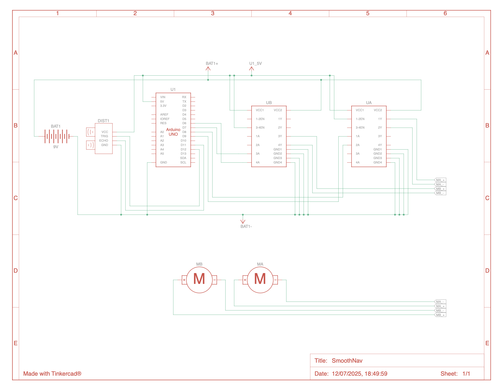
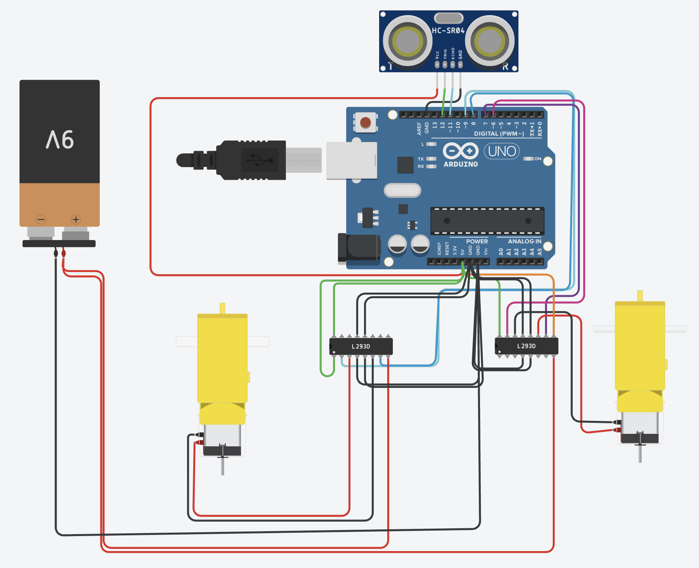

# SmothNav: Obstacle Avoiding Robot with Moving Average Filtering

## Project Overview
Obstacle-avoiding robots often suffer from jittery or unstable behavior due to noisy ultrasonic sensor readings.
SmothNav solves this by integrating a Moving Average Filter to stabilize distance measurements, ensuring reliable and smooth robot navigation decisions.

---

## Features
- HC-SR04 Ultrasonic Sensor for obstacle detection.
- Moving Average Filter for sensor data smoothing.
- L293D Motor Driver controlling two DC motors.
- Real-time distance readings and action decisions via Serial Monitor.
- Adjustable obstacle threshold distance.

---

## Components
| Component	    |    Quantity |
|---------------|--------------|
| Arduino Uno	  |       1     |
| HC-SR04 Sensor |	    1     |
| L293D Motor Driver IC|	2   |
| DC Motors	     |     2      |
| 9V Battery     |	   1      |

---

## Connnections

- HC-SR04 → Pins 12 (Trig) and 11 (Echo)
- L293D IN1–IN4 → Pins 9, 8, 7, 6
- L293D EN1, EN2 → 5V
- L293D Vcc2 → External motor power supply
- GND connections shared between Arduino and Motor Power

---

## Circuit Diagram

---

## Moving Average Filter Explanation
### Why We Use It:

Ultrasonic sensors like HC-SR04 can produce erratic readings due to:

- Electrical noise
- Irregular surface reflections
- Simulation quirks

If we rely on a single raw reading, the robot may stop, reverse, or turn unnecessarily.
To avoid this, we implemented a Moving Average Filter.

### How It Works:
- We store the last N sensor readings in a buffer (window size = 5 in our case).
- Each cycle, we update the buffer with the latest reading.
- We calculate the average of the buffer contents.
- This averaged value is used in the control logic.

### Benefit:
- Smooth transitions, no jittery movements.
- Improved reliability in noisy conditions.

---

## System Behavior Example

- Here I have set the threshold obstacle distance as 50cm.
  
| Filtered Distance(cm)  | 	 Robot Action |
|------------------------|----------------|
|   > 50 cm	           |          Move Forward|
|   ≤ 50 cm	          |  Stop → Reverse → Turn Right|

---

